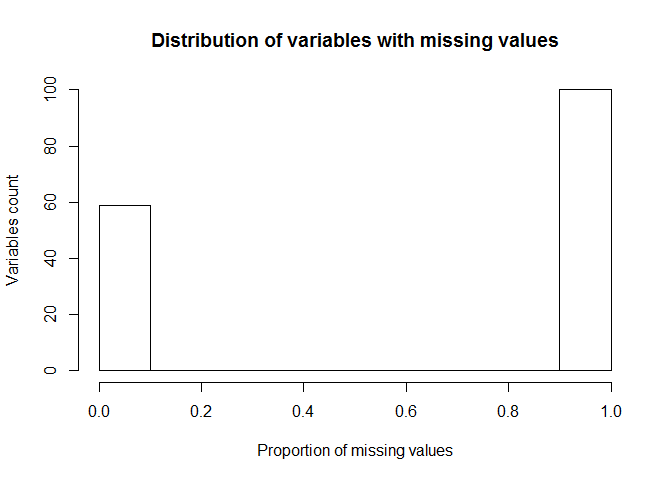

# mlproject
Gustavo  
Saturday, December 20, 2014  

##Introduction
Using devices such as Jawbone Up, Nike FuelBand, and Fitbit it is now possible to collect a large amount of data about personal activity relatively inexpensively. These type of devices are part of the quantified self movement - a group of enthusiasts who take measurements about themselves regularly to improve their health, to find patterns in their behavior, or because they are tech geeks. One thing that people regularly do is quantify how much of a particular activity they do, but they rarely quantify how well they do it. In this project, your goal will be to use data from accelerometers on the belt, forearm, arm, and dumbell of 6 participants. They were asked to perform barbell lifts correctly and incorrectly in 5 different ways. More information is available from the website here: http://groupware.les.inf.puc-rio.br/har (see the section on the Weight Lifting Exercise Dataset). 

The goal of this project is to predict the manner in which they did the exercise. This is the "classe" variable in the training set.

##Preparation
###Load required libraries

```r
library(knitr)
library(doParallel)
library(caret)
library(randomForest)
```

###Data loading
The training data for this project are available [here](https://d396qusza40orc.cloudfront.net/predmachlearn/pml-training.csv). The test data are available [here](https://d396qusza40orc.cloudfront.net/predmachlearn/pml-testing.csv).

The data for this project come from this source: http://groupware.les.inf.puc-rio.br/har. If you use the document you create for this class for any purpose please cite them as they have been very generous in allowing their data to be used for this kind of assignment. 
I load the data from a downloaded copy. The `na.string` option is used in order to fix the different coding of missing values in the provided training and testing data.

```r
pml.training <- read.csv("data/pml-training.csv", stringsAsFactors=TRUE, na.strings=c("NA", "", "#DIV/0!"))
pml.testing <- read.csv("data/pml-testing.csv", stringsAsFactors=TRUE, na.strings=c("NA", "", "#DIV/0!"))
train.X <- pml.training[,-160]
train.y <- pml.training[, 160]
round(prop.table(table(train.y)), 3)
```

```
## train.y
##     A     B     C     D     E 
## 0.284 0.194 0.174 0.164 0.184
```

```r
test.X <- pml.testing
```
###Data Cleaning
The first seven variables are not relevant for the predictive modeling

```r
# identify not relevant variables
vars <- names(train.X)
(id.vars <- vars[1:7])
```

```
## [1] "X"                    "user_name"            "raw_timestamp_part_1"
## [4] "raw_timestamp_part_2" "cvtd_timestamp"       "new_window"          
## [7] "num_window"
```
then there are many variables almost completely missing to be removed before building the model.

```r
# identify variables with too many missing values
na.count <- colSums(is.na(train.X))
na.prop <- na.count/nrow(train.X)
hist(na.prop, main="Distribution of variables with missing values",
     xlab="Proportion of missing values", ylab="Variables count")
```

 

```r
na.vars <- names(na.count [na.prop > 0.50])
keep <- setdiff(vars, union(id.vars, na.vars))
train.X <- train.X[keep]
test.X <- pml.testing[keep]
```
So, the final list of predictors to be used in the model has 52 variables.

##Model building
###Training sub-sampling
Unfortunately, having a limited availability of CPU power, I had to reduce the size of the training set.

```r
set.seed(1959)
inSubset <- createDataPartition(train.y, p=1/3, list=FALSE)
train.X <- train.X[inSubset,]
train.y <- train.y[inSubset]
```

###Held-out sample
In order to asses the out of sample error, the training data is split into training and validation sets.

```r
inTraining <- createDataPartition(train.y, p=3/4, list=FALSE)
xvalid.X <- train.X[-inTraining,]
xvalid.y <- train.y[-inTraining]
train.X <- train.X[inTraining,]
train.y <- train.y[inTraining]
```
For the model fitting, I used the Random Forest.

```r
# prepare for multiprocessing
cl <- makeCluster(3) # Assign number of cores you want to use
registerDoParallel(cl) # Register the cores.
# model parameters tuning based on repeated k-fold cross-validation
trainCtrl <- trainControl(method="repeatedcv", repeats=3, number=5)
model.full <- train(x=train.X, y=train.y, method="rf", trControl=trainCtrl)

stopCluster(cl)
model.full
```

```
## Random Forest 
## 
## 4908 samples
##   52 predictor
##    5 classes: 'A', 'B', 'C', 'D', 'E' 
## 
## No pre-processing
## Resampling: Cross-Validated (5 fold, repeated 3 times) 
## 
## Summary of sample sizes: 3927, 3927, 3925, 3927, 3926, 3927, ... 
## 
## Resampling results across tuning parameters:
## 
##   mtry  Accuracy   Kappa      Accuracy SD  Kappa SD   
##    2    0.9695737  0.9614842  0.005655463  0.007167741
##   27    0.9735125  0.9664793  0.003613584  0.004576535
##   52    0.9612206  0.9509174  0.007454496  0.009441225
## 
## Accuracy was used to select the optimal model using  the largest value.
## The final value used for the model was mtry = 27.
```
##Model assessment
###Training Confusion Matrix

```r
train.yhat <- predict(model.full)
(cm.train <- confusionMatrix(train.yhat, train.y))
```

```
## Confusion Matrix and Statistics
## 
##           Reference
## Prediction    A    B    C    D    E
##          A 1395    0    0    0    0
##          B    0  950    0    0    0
##          C    0    0  856    0    0
##          D    0    0    0  804    0
##          E    0    0    0    0  903
## 
## Overall Statistics
##                                      
##                Accuracy : 1          
##                  95% CI : (0.9992, 1)
##     No Information Rate : 0.2842     
##     P-Value [Acc > NIR] : < 2.2e-16  
##                                      
##                   Kappa : 1          
##  Mcnemar's Test P-Value : NA         
## 
## Statistics by Class:
## 
##                      Class: A Class: B Class: C Class: D Class: E
## Sensitivity            1.0000   1.0000   1.0000   1.0000    1.000
## Specificity            1.0000   1.0000   1.0000   1.0000    1.000
## Pos Pred Value         1.0000   1.0000   1.0000   1.0000    1.000
## Neg Pred Value         1.0000   1.0000   1.0000   1.0000    1.000
## Prevalence             0.2842   0.1936   0.1744   0.1638    0.184
## Detection Rate         0.2842   0.1936   0.1744   0.1638    0.184
## Detection Prevalence   0.2842   0.1936   0.1744   0.1638    0.184
## Balanced Accuracy      1.0000   1.0000   1.0000   1.0000    1.000
```

```r
train.error <- round((1-cm.train$overall["Accuracy"])*100,1)
```
The in sample error was 0% 

###Cross-validation Confusion Matrix

```r
xvalid.yhat <- predict(model.full, newdata=xvalid.X)                
(cm.xvalid <- confusionMatrix(xvalid.yhat, xvalid.y))
```

```
## Confusion Matrix and Statistics
## 
##           Reference
## Prediction   A   B   C   D   E
##          A 463   7   0   0   0
##          B   0 307   3   0   1
##          C   1   2 279   9   0
##          D   0   0   3 259   2
##          E   1   0   0   0 297
## 
## Overall Statistics
##                                           
##                Accuracy : 0.9823          
##                  95% CI : (0.9746, 0.9881)
##     No Information Rate : 0.2846          
##     P-Value [Acc > NIR] : < 2.2e-16       
##                                           
##                   Kappa : 0.9775          
##  Mcnemar's Test P-Value : NA              
## 
## Statistics by Class:
## 
##                      Class: A Class: B Class: C Class: D Class: E
## Sensitivity            0.9957   0.9715   0.9789   0.9664   0.9900
## Specificity            0.9940   0.9970   0.9911   0.9963   0.9993
## Pos Pred Value         0.9851   0.9871   0.9588   0.9811   0.9966
## Neg Pred Value         0.9983   0.9932   0.9955   0.9934   0.9978
## Prevalence             0.2846   0.1934   0.1744   0.1640   0.1836
## Detection Rate         0.2834   0.1879   0.1707   0.1585   0.1818
## Detection Prevalence   0.2876   0.1903   0.1781   0.1616   0.1824
## Balanced Accuracy      0.9949   0.9842   0.9850   0.9814   0.9946
```

```r
xvalid.error <- round((1-cm.xvalid$overall["Accuracy"])*100,1)
```
###Expected out of sample performance
The out of sample error was 1.8%. 
So, even if I did not use all of the available training data, the results seemed to be quite good.
And actually the result of the prediction assignment submission was correct 19 out of 20 test samples.

##Test data prediction

```r
(test.yhat <- predict(model.full, newdata=test.X))
```

```
##  [1] B A A A A E D B A A B C B A E E A B B B
## Levels: A B C D E
```
###Submission files creation

```r
answers <- as.character(test.yhat)
pml_write.files <- function(x) {
    n <- length(x)
    for(i in 1:n) {
        filename <- paste0("problem_id_", i, ".txt")
        write.table(x[i], file=filename, quote=FALSE, row.names=FALSE, col.names=FALSE)
    }
}
pml_write.files(answers)
```


